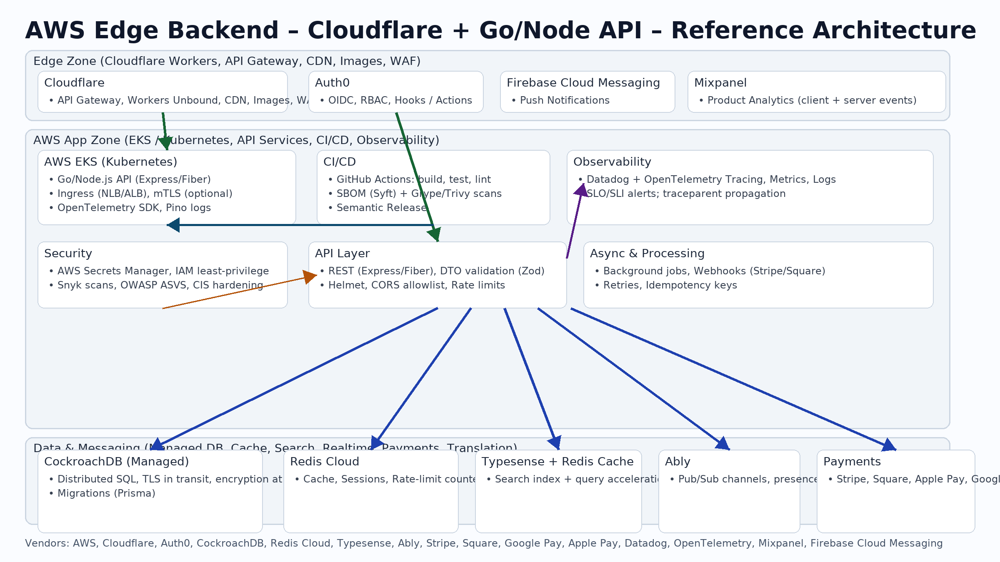

# aws-edge-backend-starter

Production-ready, security-first backend starter for an AWS + Cloudflare edge architecture. TypeScript + Node.js + Express, with secure defaults, CI/CD, IaC, tests, and high-quality docs.

## Features
- Express API with Helmet, CORS allowlist, rate limiting, DTO validation (Zod), and structured logs (pino)
- OpenTelemetry tracing + `traceparent` propagation
- AuthN/AuthZ integration points for Auth0 (OIDC/JWT middleware hook)
- Redis Cloud for cache/session, CockroachDB via Prisma ORM (parameterized queries)
- Typesense search integration stub with Redis cache
- Ably realtime stub and Stripe/Square webhook scaffolds with idempotency
- Dockerized dev and prod builds; least-privilege user
- Terraform modules for VPC/IAM/secrets-managed DB/Redis (scoped for validation) with remote state guidance
- GitHub Actions: security, quality, tests, SBOM (Syft), image scan (Trivy), IaC scan (tfsec/Checkov)
- Semantic-release, Conventional Commits, commitlint, pre-commit hooks

## Architecture


## Quickstart

```bash
# 1) Choose a local folder path and create it
LOCAL_DIR=~/projects/aws-edge-backend-starter
mkdir -p "$LOCAL_DIR"

# 2) Download and extract
# (after saving the provided ZIP from ChatGPT)
unzip aws-edge-backend-starter.zip -d "$LOCAL_DIR"

cd "$LOCAL_DIR"/aws-edge-backend-starter

# 3) Install deps
corepack enable
pnpm install  # or: npm ci

# 4) Configure environment
cp .env.example .env
# Fill values as needed for local dev

# 5) Run locally (without Docker)
pnpm run dev

# 6) Run with Docker
make docker-up
# Visit http://localhost:3000/health

# 7) Tests & coverage
pnpm test -- --coverage

# 8) Generate SBOM (requires Syft)
make sbom
```

## Environment

- Never commit real secrets. Local dev uses `.env`; production uses AWS Secrets Manager.
- See `config/env.ts` for strict schema (Zod).

## Security Model
- HTTP: Helmet, HSTS, sane timeouts, payload limits, rate limiting, CORS allowlist
- Data: Prisma parameterized queries; TLS in transit; at-rest encryption via managed services
- Supply chain: lockfiles, SBOM (Syft), vulnerability scans (npm audit/Trivy), license checks
- Docker: non-root, minimal base, healthcheck; read-only rootfs via compose `tmpfs` and flags
- IAM: least-privilege, resource tagging, Terraform scans (tfsec/Checkov)

## Operations
- Logs: pino JSON, trace IDs included
- Tracing: OpenTelemetry SDK with sampling notes
- CI: `.github/workflows/ci.yml` (app) and `iac.yml` (Terraform)
- Release: semantic-release on main tags

## Useful Commands

```bash
pnpm run lint
pnpm run format
pnpm run build
pnpm run start

# Terraform
make iac-validate

# Clean Docker
make docker-down
```

## Release & Versioning
- Conventional Commits enforced by commitlint
- `release.yml` runs semantic-release to tag and publish GitHub Releases

## Verify After Download
- [ ] `pnpm run lint` passes
- [ ] `pnpm test` passes with coverage ≥85%
- [ ] `pnpm run dev` starts and `GET /health` returns 200
- [ ] `make sbom` produces `sbom.spdx.json`
- [ ] `make iac-validate` runs fmt/validate successfully

## License
MIT
